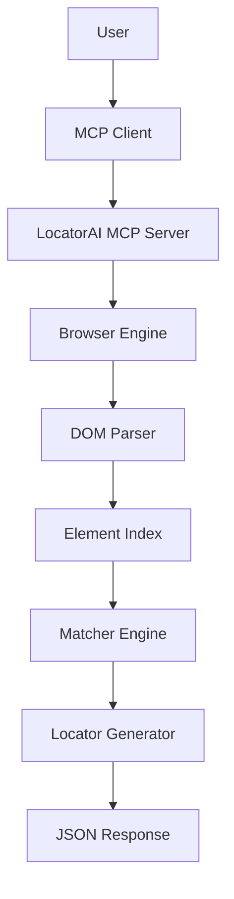

# LocatorAI MCP

      

> An AI-powered Model Context Protocol (MCP) server that understands natural language, identifies UI elements on web pages, and generates reliable automation locators for Robot Framework, Selenium, Playwright, and other testing tools.

LocatorAI MCP is designed for automation engineers, QA teams, and AI agents who want to reduce the manual effort of inspecting web pages and crafting stable selectors. Instead of manually opening DevTools, reading DOM structures, and experimenting with XPath or CSS, users can describe the element they want in plain English and receive ranked locator suggestions backed by intelligent matching.

Whether you are building test automation, creating browser agents, or integrating AI into your QA workflow, LocatorAI MCP provides a structured, extensible interface for discovering meaningful UI elements from the page and generating robust automation-ready locators.

---

## Why LocatorAI MCP?

Modern web applications are dynamic, heavily styled, and often difficult to automate reliably. Locators based on brittle selectors such as overly generic XPath expressions or unstable DOM paths frequently break during UI changes.

LocatorAI MCP addresses this by combining:

- Natural language understanding of user intent
- Page analysis through browser automation and DOM parsing
- Intelligent element matching against the page structure
- Multiple locator generation strategies
- Stability-aware ranking of results
- Framework-specific outputs for common automation tools

The goal is not simply to find an element, but to find the right element and return locators that are likely to remain robust as the UI evolves.

---

## Example

### User request

```json
{
  "url": "https://example.com/login",
  "query": "Login button"
}
```

### Example response

```json
{
  "element": "Login Button",
  "confidence": 98,
  "recommended": {
    "type": "id",
    "locator": "id=loginBtn"
  },
  "alternatives": [
    "xpath=//button[@id='loginBtn']",
    "css=#loginBtn",
    "xpath=//button[normalize-space()='Login']"
  ]
}
```

---

## Key Features

### 🧠 Natural language element search
Users can describe the target element using natural language such as “Login button”, “Search field”, “Country dropdown”, or “Submit form button”. The server interprets intent and translates it into a structured element-selection task.

### 🤖 AI-assisted element matching
The matching engine evaluates candidate elements based on semantics, context, visible text, labels, roles, and surrounding DOM structure. This helps identify the correct target even when the page markup is not obvious.

### 📊 Intelligent locator ranking
Multiple locator strategies are generated and ranked by expected stability and reliability. This allows teams to prefer selectors that are less fragile and more maintainable.

### 🔎 XPath generation
The system can produce XPath expressions tailored for common automation scenarios, including text-based, attribute-based, and structural locators.

### 🎨 CSS selector generation
The server can produce CSS selectors for elements that are easier to maintain in many automation frameworks.

### 🤖 Robot Framework locators
LocatorAI MCP can return selectors in formats that map well to Robot Framework-style automation patterns.

### 🧪 Selenium locators
The output can be expressed in Selenium-friendly formats, making it easy to integrate with existing browser automation pipelines.

### 🎭 Playwright locators
Playwright-specific locator strategies can be generated for modern cross-browser automation scenarios.

### ⭐ Confidence scoring
Each candidate element is assigned a confidence score that indicates the system’s confidence in the match quality.

### ✅ Multiple locator suggestions
Rather than returning a single brittle selector, the server provides alternatives so teams can choose the most appropriate option.

### 🛡️ Locator validation
Generated locators can be validated against the live page to ensure they resolve to the intended element before they are returned.

### 🧱 Extensible architecture
The design is deliberately modular, allowing future enhancements such as vision-based detection, semantic matching, and framework-specific output generation.

### 🌐 MCP server implementation
The project exposes tools through the Model Context Protocol, making it usable by AI assistants, automation agents, and MCP-compatible clients.

### 📦 Structured JSON responses
Responses are designed to be machine-readable, easy to log, and simple to integrate into automation pipelines or agent workflows.

---

## Architecture

LocatorAI MCP follows a layered architecture designed for clarity and extensibility:



### Component responsibilities

- User: Provides a target URL and a natural-language description of the goal.
- MCP Client: Sends requests to the server using the Model Context Protocol.
- LocatorAI MCP Server: Orchestrates the workflow and exposes the tool surface.
- Browser Engine: Loads the web page and captures a reliable view of the rendered DOM.
- DOM Parser: Extracts semantic information such as text, labels, attributes, and structure.
- Element Index: Builds a searchable representation of page elements.
- Matcher Engine: Compares the request against the indexed elements and ranks candidates.
- Locator Generator: Produces XPath, CSS, Robot Framework, Selenium, and Playwright-style locators.
- JSON Response: Returns a structured result containing the selected element, confidence, and alternatives.

---

## Proposed Project Structure

```text
locator-ai-mcp/
├── server.py
├── requirements.txt
├── README.md
├── services/
│   ├── browser.py
│   ├── parser.py
│   ├── matcher.py
│   ├── locator.py
│   └── validator.py
├── models/
│   └── element.py
├── prompts/
│   └── matcher_prompt.py
├── tests/
└── docs/
```

### Folder overview

- server.py: Main entry point for the MCP server and tool registration.
- requirements.txt: Python dependencies for the project.
- services/: Core business logic for browser automation, parsing, matching, locator generation, and validation.
- models/: Data models for element metadata, matcher results, and locator responses.
- prompts/: Prompt templates or logic used by AI-driven matching workflows.
- tests/: Unit and integration tests for correctness and regression prevention.
- docs/: Project documentation, architecture notes, and design references.

---

## Tech Stack

| Technology | Purpose |
| --- | --- |
| Python | Primary implementation language for the MCP server and services |
| FastMCP | Lightweight MCP server framework for exposing tools and resources |
| Playwright | Browser automation and page rendering for dynamic web applications |
| BeautifulSoup | HTML parsing and structural analysis |
| lxml | Fast and robust XML/HTML parsing and XPath handling |
| Pydantic | Data validation and structured response models |
| OpenAI API | Optional LLM-based semantic matching and intent understanding |
| Ollama | Local LLM support for private or offline inference scenarios |
| Robot Framework | Target test automation framework for generated locators |
| Selenium | Cross-browser automation integration |
| Playwright | Modern browser automation and locator generation |
| GitHub Actions | CI/CD automation and reliability checks |

---

## Installation

### Prerequisites

- Python 3.10 or newer
- pip
- A working browser runtime for Playwright

### Clone the repository

```bash
git clone https://github.com/your-username/locatorai-mcp.git
cd locatorai-mcp
```

### Create and activate a virtual environment

```bash
python3 -m venv .venv
source .venv/bin/activate
```

### Install dependencies

```bash
pip install -r requirements.txt
```

### Install Playwright browsers

```bash
playwright install --with-deps chromium
```

### Run the MCP server

```bash
python server.py
```

If you are using an MCP-compatible client, connect it to the server endpoint exposed by your runtime and start sending requests.

---

## Example Usage

### Example MCP request

```json
{
  "tool": "find_element",
  "arguments": {
    "url": "https://example.com/login",
    "query": "Username textbox"
  }
}
```

### Example MCP response

```json
{
  "element": "Username Input",
  "confidence": 95,
  "recommended": {
    "type": "name",
    "locator": "name=username"
  },
  "alternatives": [
    "xpath=//input[@name='username']",
    "css=input[name='username']"
  ]
}
```

This response format is intentionally simple and structured so it can be consumed by test tools, automation agents, or custom UI workflows.

---

## API Reference

### Tool: find_element(url, query)

Finds the most relevant UI element on a page based on a natural-language description.

#### Parameters

| Name | Type | Required | Description |
| --- | --- | --- | --- |
| url | string | Yes | The target website URL to inspect |
| query | string | Yes | Natural language description of the UI element |

#### Response

| Field | Type | Description |
| --- | --- | --- |
| element | string | Human-readable element name |
| confidence | integer | Match confidence from 0 to 100 |
| recommended | object | Best locator suggestion with type and locator |
| alternatives | array | Additional locator suggestions |

#### Error handling

The server should return structured errors when:

- The URL is invalid or unreachable
- The page cannot be loaded
- No matching element is found
- The request is malformed
- The underlying browser or parser fails

Example error response:

```json
{
  "error": "No matching element found",
  "details": "The query did not match any candidate UI element on the page."
}
```

#### Example request

```json
{
  "url": "https://example.com/login",
  "query": "Password field"
}
```

#### Example response

```json
{
  "element": "Password Input",
  "confidence": 93,
  "recommended": {
    "type": "id",
    "locator": "id=password"
  },
  "alternatives": [
    "xpath=//input[@id='password']",
    "css=#password"
  ]
}
```

---

## Design Philosophy

LocatorAI MCP is shaped by a few core principles:

- Modular architecture: Each component has a focused responsibility and can evolve independently.
- Framework independence: The project aims to support multiple automation ecosystems rather than locking users into a single toolchain.
- Reliable locator generation: Stability matters more than convenience; generated selectors should be understandable and resilient.
- Extensibility: New matching strategies, output formats, and browser capabilities should be easy to add.
- AI-assisted automation: The project uses AI where it adds real value, especially in interpreting user intent and mapping it to page elements.
- Testability: Core services should be isolated and tested independently.
- Clean separation of concerns: Browser automation, parsing, matching, and locator generation each have distinct roles.

This makes the system easier to maintain, easier to extend, and more useful in real-world automation pipelines.

---

## Roadmap

### Phase 1: Foundation

- Browser automation integration
- DOM parsing and structure extraction
- Basic XPath and CSS generation
- JSON response formatting

### Phase 2: Intelligence

- Intelligent element matching
- Confidence scoring
- Multiple locator suggestions
- Locator validation against live pages

### Phase 3: AI Integration

- LLM-based semantic matching
- Natural language intent refinement
- Better handling of ambiguous UI descriptions

### Phase 4: Advanced Automation Support

- Self-healing locators
- Page Object Model generation
- Robot Framework resource file generation
- Selenium Page Object generation
- Playwright code generation

### Phase 5: Scale and Coverage

- Full website crawling
- Test case generation
- Accessibility-aware locator generation
- Multi-language support
- Authentication-aware browsing
- SPA framework support
- Dynamic element detection

---

## Planned Future Features

The following features are being considered for future releases:

- AI-powered semantic matching
- Vision-based UI detection
- Screenshot analysis
- Self-healing locators
- Automatic Page Object Model generation
- Robot Framework resource file generation
- Selenium Page Object generation
- Playwright code generation
- Full website crawling
- Test case generation
- Accessibility-aware locator generation
- Multi-language support
- Authentication support
- SPA framework support
- Dynamic element detection

---

## Contributing

Contributions are welcome and encouraged.

If you would like to contribute, please follow these guidelines:

1. Fork the repository.
2. Create a feature branch.
3. Implement your change with clear, focused code.
4. Add or update tests where appropriate.
5. Submit a pull request with a concise explanation of the change.

Please keep pull requests focused, documented, and easy to review. If you are introducing a new feature, it is helpful to include a short rationale and examples.

---

## License

This project is licensed under the MIT License.

```text
MIT License

Copyright (c) 2026 LocatorAI MCP

Permission is hereby granted, free of charge, to any person obtaining a copy
of this software and associated documentation files (the "Software"), to deal
in the Software without restriction, including without limitation the rights
to use, copy, modify, merge, publish, distribute, sublicense, and/or sell
copies of the Software, and to permit persons to whom the Software is
furnished to do so, subject to the following conditions:

The above copyright notice and this permission notice shall be included in all
copies or substantial portions of the Software.

THE SOFTWARE IS PROVIDED "AS IS", WITHOUT WARRANTY OF ANY KIND, EXPRESS OR
IMPLIED, INCLUDING BUT NOT LIMITED TO THE WARRANTIES OF MERCHANTABILITY,
FITNESS FOR A PARTICULAR PURPOSE AND NONINFRINGEMENT. IN NO EVENT SHALL THE
AUTHORS OR COPYRIGHT HOLDERS BE LIABLE FOR ANY CLAIM, DAMAGES OR OTHER
LIABILITY, WHETHER IN AN ACTION OF CONTRACT, TORT OR OTHERWISE, ARISING FROM,
OUT OF OR IN CONNECTION WITH THE SOFTWARE OR THE USE OR OTHER DEALINGS IN THE
SOFTWARE.
```

---

## Closing Thoughts

LocatorAI MCP represents a practical step toward more intelligent and human-friendly automation. By combining browser intelligence, AI-assisted matching, and structured locator generation, it aims to make UI automation more accessible, more reliable, and more adaptable to modern web experiences.

If you are building automation workflows, QA tools, or AI-driven browser agents, this project is a strong foundation for a future where locating UI elements feels less like manual inspection and more like guided intelligence.
