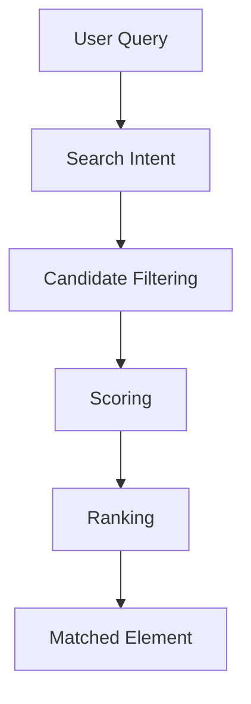

# LocatorAI


> **LocatorAI** is an AI-powered Browser Automation Engine with Model Context Protocol (MCP) support for intelligent element discovery, locator generation, browser automation, and future AI-driven test generation.


## Table of Contents

- [Overview](#overview)
- [Vision](#vision)
- [Problem Statement](#problem-statement)
- [What Makes LocatorAI Different](#what-makes-locatorai-different)
- [Core Principles](#core-principles)
- [High-Level Architecture](#high-level-architecture)
- [Planned Folder Structure](#planned-folder-structure)
- [Core Components](#core-components)
- [Browser Session Strategy](#browser-session-strategy)
- [Element Model](#element-model)
- [Search Pipeline](#search-pipeline)
- [Locator Generation](#locator-generation)
- [Locator Validation](#locator-validation)
- [Planned MCP Tools](#planned-mcp-tools)
- [AI Strategy](#ai-strategy)
- [Example Request / Response](#example-request--response)
- [Roadmap](#roadmap)
- [Authentication Strategy](#authentication-strategy)
- [Supported Browsers](#supported-browsers)
- [Supported Automation Frameworks](#supported-automation-frameworks)
- [Why This Project Is Different](#why-this-project-is-different)
- [Contributing](#contributing)
- [License](#license)

---

## Overview

LocatorAI is not simply an XPath or CSS selector generator. It is a browser automation intelligence engine designed for enterprises, QA organizations, automation teams, and AI-driven agents that need reliable element discovery and robust locator generation across modern, dynamic web applications.

The engine provides a bridge between natural language intent and real browser DOM state. It leverages browser automation, semantic element modeling, and extensible MCP-native tooling so that automation engineers and AI agents can ask for UI elements without knowing HTML or the underlying automation library.

### Key capabilities

- Natural language element discovery
- AI-assisted semantic matching
- Multi-strategy locator generation
- Enterprise-grade browser session handling
- MCP-native tool surface for agent automation
- Validation-driven result recommendations

---

## Vision

LocatorAI is **not just an XPath generator**.

LocatorAI is a browser automation intelligence engine that allows AI agents and automation engineers to interact with web applications using natural language. Rather than forcing users to inspect HTML and manually write selectors, LocatorAI understands requests such as:

- Find the Login button
- Find the Username textbox
- Find the Country dropdown
- Generate Robot Framework locators
- Validate this XPath
- Generate a Page Object
- Generate a Robot Framework Resource File

LocatorAI performs browser automation, understands the DOM, identifies the correct element, ranks locator strategies, validates them, and returns structured results.

The long-term goal is to build the browser automation backend for AI agents so the AI never needs to understand HTML directly.

---

## Problem Statement

Current automation workflows force teams to:

- Inspect HTML manually
- Write XPath manually
- Maintain brittle locators
- Handle dynamic pages manually
- Understand Selenium or Playwright APIs

These problems create fragile automation suites, slow onboarding, and poor maintenance velocity. LocatorAI abstracts all of this behind AI-powered services, providing a reliable, enterprise-ready automation intelligence layer.

---

## What Makes LocatorAI Different

LocatorAI is designed as an automation intelligence layer rather than another testing library.

| Dimension | LocatorAI | Selenium / Playwright | Robot Framework | AI Testing Platforms |
| --- | --- | --- | --- | --- |
| Natural language intent | ✅ | ❌ | ❌ | Limited |
| MCP-native tooling | ✅ | ❌ | ❌ | Rare |
| Multi-strategy locator ranking | ✅ | ⚠️ | ⚠️ | ⚠️ |
| Validation before recommendation | ✅ | ❌ | ❌ | ⚠️ |
| Persistent browser session support | ✅ | Optional | Optional | Limited |
| Enterprise extensibility | ✅ | ⚠️ | ⚠️ | Emerging |
| AI-assisted semantics | ✅ | ❌ | ❌ | Partial |

LocatorAI does not compete with browser automation frameworks; it complements them by generating stable, validated locators and by allowing AI agents to interact with applications at a higher semantic level.

---

## Core Principles

LocatorAI is built according to enterprise-grade principles:

- **Browser Agnostic**: Support multiple browser engines without locking clients.
- **Framework Agnostic**: Produce locators for Robot Framework, Selenium, Playwright, and future targets.
- **AI Agnostic**: Support multiple LLM providers and self-hosted setups.
- **Authentication Agnostic**: Pluggable authentication providers with no hardcoded login logic.
- **MCP Native**: Designed to expose tools through Model Context Protocol.
- **Extensible**: Architected for plug-ins, new services, and future AI capabilities.
- **Modular**: Separate services for parsing, matching, locator generation, validation, and authentication.
- **Enterprise Ready**: Secure, maintainable, and built for real-world web automation.

---

## High-Level Architecture

The architecture is intentionally layered and service-driven, isolating responsibilities while enabling a cohesive automation pipeline.

```mermaid
flowchart LR
    A[MCP Client] --> B[Automation Engine]
    B --> C[Session Manager]
    C --> D[Authentication Service]
    D --> E[Browser Session]
    E --> F[Parser Service]
    F --> G[Matcher Service]
    G --> H[Locator Generator]
    H --> I[Validator Service]
    I --> J[Structured Response]
```



### Architecture flow

1. **MCP Client**: Sends requests from an AI agent, automation orchestrator, or CLI.
2. **Automation Engine**: Orchestrates the workflow end-to-end.
3. **Session Manager**: Maintains browser sessions and storage state.
4. **Authentication Service**: Handles login flows and credential management.
5. **Browser Session**: Executes page navigation and DOM rendering.
6. **Parser Service**: Extracts structured element metadata.
7. **Matcher Service**: Scores candidate elements for the request.
8. **Locator Generator**: Builds multi-strategy locators.
9. **Validator Service**: Verifies locator stability and correctness.
10. **Structured Response**: Returns a machine-readable result.

---

## Planned Folder Structure

LocatorAI is intended to follow a clear architecture that supports both developer productivity and enterprise maintainability.

```text
locator-ai/
├── app/
│   ├── engine/
│   │   └── locator_engine.py
│   ├── services/
│   │   ├── browser_service.py
│   │   ├── parser_service.py
│   │   ├── matcher_service.py
│   │   ├── locator_service.py
│   │   ├── validator_service.py
│   │   └── authentication_service.py
│   ├── models/
│   │   ├── context.py
│   │   ├── element.py
│   │   ├── locator.py
│   │   ├── browser_config.py
│   │   └── response.py
│   ├── auth/
│   │   ├── base_auth_provider.py
│   │   ├── username_password.py
│   │   ├── azure_ad.py
│   │   │   └── ...
│   ├── mcp/
│   │   ├── server.py
│   │   └── tools.py
│   └── main.py
├── tests/
├── docs/
├── examples/
├── .gitignore
├── pyproject.toml
└── README.md
```

### Purpose of each folder

- `app/engine/`: Contains the core engine logic that orchestrates the automation workflow.
- `app/services/`: Encapsulates the functional services responsible for browser automation, parsing, matching, locator generation, and validation.
- `app/models/`: Defines the structured data models used to represent page state, element metadata, locators, and response payloads.
- `app/auth/`: Houses pluggable authentication providers for enterprise login workflows.
- `app/mcp/`: Contains MCP integration, tool registration, and server definitions.
- `tests/`: Includes unit tests, integration tests, and end-to-end test scenarios.
- `docs/`: Stores architecture documents, design decisions, and reference guides.
- `examples/`: Provides sample scripts, request payloads, and integration examples.

---

## Core Components

### Automation Engine

The Automation Engine is the orchestration layer that manages the flow from request to response. It coordinates browser sessions, authentication, parsing, matching, locator generation, and validation.

### Session Manager

Session Manager maintains long-lived browser sessions, storage state, cookies, and authentication context. It avoids opening and closing browsers for every request so that automation remains efficient and stateful.

### Authentication Service

The Authentication Service is responsible for login flows, credential injection, storage state management, and enterprise identity providers. It is pluggable and supports custom authentication providers.

### Parser Service

The Parser Service analyzes rendered page markup and creates a structured object model for every discoverable DOM element.

### Matcher Service

The Matcher Service evaluates user intent against the parsed element model. It filters candidates, scores them, and selects the best match.

### Locator Service

The Locator Service generates many locator strategies for a matched element. It produces framework-aware output and confidence metadata.

### Validator Service

The Validator Service confirms that generated locators are valid, unique, visible, enabled, and stable. Only validated locators should be recommended.

### Screenshot Service

A future service that can capture screenshots for visual debugging, locator inspection, and report generation.

### Navigation Service

A future service that will manage advanced navigation, redirection handling, and page flow automation.

### AI Service (Future)

A future AI service will support semantic matching, query expansion, self-healing, and test generation.

---

## Browser Session Strategy

LocatorAI uses persistent browser sessions instead of opening a new browser process for every request. This approach is essential for enterprise automation because it preserves:

- Authentication state
- Session cookies
- Local storage and storage state
- Multi-step login flows
- Stateful interactions across pages

### Why persistent sessions matter

Opening a new browser for each request is expensive and brittle. Persistent sessions improve performance and allow LocatorAI to manage real-world enterprise login sequences, cookie-based authentication, and stateful navigation.

### Session state handling

- **Storage state**: Browser session state is captured and reused across requests.
- **Cookies**: Logged-in sessions remain available for subsequent operations.
- **Authentication**: Credentials and session state can be applied once and reused.
- **Enterprise login handling**: Multi-step flows such as SSO, Azure AD, and Okta can be maintained in a live session.

---

## Element Model

Every DOM element is converted into a structured object to support intelligent searching and scoring.

Each element model should contain:

- `tag`
- `element_type`
- `label`
- `text`
- `placeholder`
- `role`
- `aria-label`
- `id`
- `name`
- `visibility`
- `enabled`
- `searchable_text`
- `attributes`
- `xpath`
- `css`

### Why this model matters

A structured element model allows LocatorAI to reason beyond raw markup. It can understand semantic clues such as label association, placeholder hints, accessible names, and user-facing text.

This enables intelligent searches such as:

- “Login button” → a button with visible text or accessible label “Login”
- “Username textbox” → an input with type text and associated label “Username”
- “Country dropdown” → a select or combobox element with label or option text indicating country

---

## Search Pipeline

LocatorAI's search pipeline is designed to be transparent and deterministic, with AI used only where it adds meaningful value.



### Pipeline stages

1. **User Query**
   - A natural language request such as “Find the Login button.”
2. **Search Intent**
   - The system extracts intent, action, element type, and target semantics.
3. **Candidate Filtering**
   - The engine narrows the DOM to relevant elements such as buttons, links, inputs, and selects.
4. **Scoring**
   - Each candidate is scored based on text match, label match, role, attributes, and visibility.
5. **Ranking**
   - Candidates are ranked to choose the best match and recommended locators.
6. **Matched Element**
   - The engine returns the selected element plus alternative candidates and locators.

### Why AI is not required for simple searches

Many searches are deterministic and can be handled by rule-based filtering and scoring. AI is reserved for ambiguous or complex queries where language nuance or synonym expansion is required.

This design makes LocatorAI faster, cheaper, and more predictable than using AI for every request.

---

## Locator Generation

LocatorAI generates multiple locator strategies for each matched element, enabling automation teams to choose the best fit for their framework and stability requirements.

### Strategy examples

- **ID**: `id=loginBtn`
- **Name**: `name=username`
- **CSS**: `css=#loginBtn`
- **XPath**: `xpath=//button[@id='loginBtn']`
- **Relative XPath**: `xpath=//form//button[normalize-space()='Login']`
- **Robot Framework**: `css: #loginBtn` or `xpath://button[@id='loginBtn']`
- **Selenium**: `By.ID('loginBtn')`, `By.XPATH('//button[@id="loginBtn"]')`
- **Playwright**: `page.locator('#loginBtn')`

### Locator metadata

Every locator includes:

- `strategy`
- `value`
- `framework`
- `confidence`
- `recommended`
- `reason`

### Recommended locators

Locators are classified and ranked. Only locators that pass validation and stability checks should be marked as recommended.

---

## Locator Validation

Locator validation ensures that generated selectors are not only syntactically correct but also reliable in the current page context.

### Validation checks

- **Exists**: The locator resolves to at least one element.
- **Unique**: It uniquely identifies the intended element.
- **Visible**: The element is visible in the page layout.
- **Enabled**: The element is enabled and interactable.
- **Stable**: The locator is not overly brittle or dependent on ephemeral page structure.

Only validated locators should be recommended to automation engineers and AI agents.

---

## Planned MCP Tools

LocatorAI will expose a phased MCP tool surface that supports both basic automation and advanced agent-driven workflows.

### Phase 1

- `authenticate()`
- `navigate()`
- `find_element()`
- `find_elements()`
- `generate_locators()`

### Phase 2

- `validate_locator()`
- `take_screenshot()`
- `inspect_page()`
- `heal_locator()`

### Phase 3

- `generate_page_object()`
- `generate_robot_resource()`
- `generate_playwright_code()`
- `generate_test_case()`

---

## AI Strategy

LocatorAI is intentionally not AI-first. It is intelligence-first.

### Rule-based responsibilities

- Parsing page structure
- Classifying element roles and types
- Filtering and scoring candidates
- Validating locators

### AI-assisted responsibilities

- Complex query understanding
- Synonym expansion
- Ambiguous element resolution
- Self-healing strategies
- Test generation and code scaffolding

### Why this hybrid approach works

- **Faster**: Rule-based processing is deterministic and low-latency.
- **Cheaper**: Less AI usage means lower inference cost.
- **More deterministic**: Rule-based systems provide predictable outcomes for simple queries.
- **More flexible**: AI is available for nuanced language and ambiguous requests.

---

## Example Request / Response

### Input

```json
{
  "url": "https://example.com",
  "query": "Login button"
}
```

### Output

```json
{
  "matched_element": "Login Button",
  "confidence": 98,
  "recommended_locator": {
    "strategy": "id",
    "value": "loginBtn",
    "framework": "playwright",
    "confidence": 98,
    "recommended": true,
    "reason": "Stable ID-based locator"
  },
  "alternatives": [
    {
      "strategy": "css",
      "value": "#loginBtn",
      "framework": "css",
      "confidence": 92,
      "recommended": true,
      "reason": "Simple CSS selector"
    },
    {
      "strategy": "xpath",
      "value": "//button[normalize-space()='Login']",
      "framework": "xpath",
      "confidence": 88,
      "recommended": false,
      "reason": "Text-based fallback locator"
    }
  ]
}
```

---

## Roadmap

### Phase 1: Foundation

- Core models and engine orchestration
- Browser automation backend
- Parser service
- Matcher service
- Locator generation
- CLI and developer tooling

### Phase 2: Authentication and Session Management

- Authentication providers
- Persistent browser sessions
- Validation service
- Screenshot and page inspection services

### Phase 3: MCP Server

- MCP-native tool registration
- Tool surface for automation agents
- Structured response schema

### Phase 4: AI Integration

- Semantic matching
- Synonym and intent expansion
- Self-healing locators
- Query disambiguation

### Phase 5: Framework Output Support

- Robot Framework locators and resource generation
- Page object generation
- Playwright and Selenium code generation
- Test case scaffolding

### Phase 6: Enterprise Integrations

- Plugin system
- Third-party integrations
- VS Code extension
- Observability and reporting

---

## Authentication Strategy

Authentication in LocatorAI is designed to be pluggable and non-intrusive. The engine should support multiple authentication providers without hardcoding login logic into the core pipeline.

### Supported strategies

- No Authentication
- Username / Password
- Azure AD
- Okta
- Google Login
- Cookie Authentication
- Playwright Storage State
- Interactive Login
- Custom Authentication Providers

### Enterprise approach

- Authentication providers are separate modules.
- Credential handling is secure and auditable.
- Session state persists across requests.
- Authentication is only one part of the browser session lifecycle.

---

## Supported Browsers

LocatorAI is designed to support a wide set of browser engines:

- Chromium
- Chrome
- Microsoft Edge
- Firefox
- WebKit

This ensures compatibility across desktop and modern enterprise browser environments.

---

## Supported Automation Frameworks

LocatorAI can generate locators for these frameworks:

- Robot Framework
- Selenium
- Playwright
- Cypress (planned)
- WebdriverIO (planned)

By remaining framework agnostic, LocatorAI enables customers to integrate the results into their chosen automation stack.

---

## Why Persistent Browser Sessions are Important

A browser session is more than a page load. It is a stateful environment with authentication cookies, local storage, session storage, and browser context.

Persistent browser sessions enable:

- authenticated navigation across page flows
- multi-page test scenarios
- session reuse for speed and reliability
- stable handling of enterprise login methods

One-off browser launches are fine for simple scripts, but enterprise automation requires session continuity.

---

## Element Model and Metadata

LocatorAI models each element with an enriched metadata object. This object enables intelligent searches instead of brittle text matching.

### Core fields

- `tag`
- `element_type`
- `label`
- `text`
- `placeholder`
- `role`
- `aria-label`
- `id`
- `name`
- `visibility`
- `enabled`
- `searchable_text`
- `attributes`
- `xpath`
- `css`

### Why this matters

When element discovery is grounded in structured metadata, LocatorAI can:

- identify semantically relevant elements
- match visible user-facing labels
- prefer stable attribute-based locators
- avoid brittle DOM path heuristics

This structured approach enables robust automation across dynamic pages.

---

## Search Pipeline Explained

The LocatorAI search pipeline is built to isolate responsibilities and deliver predictable results.

### User Query

Natural language input such as “Find the Login button.”

### Search Intent

The system analyzes intent and target element semantics.

### Candidate Filtering

Only elements that match the expected type and role are considered.

### Scoring

Candidates are scored against the query using both direct matches and semantic features.

### Ranking

Top candidates are ranked and the best match is selected.

### Matched Element

The output includes the matched element, alternative candidates, and locator recommendations.

This pipeline ensures that simple queries are resolved deterministically while more complex requests benefit from AI-assisted semantics.

---

## Locator Generation Explained

LocatorAI does not return a single brittle selector. It returns multiple strategies with confidence metadata.

### Locator categories

- Attribute-based locators (ID, name)
- Framework-specific locators (Robot Framework, Selenium, Playwright)
- CSS selectors
- XPath expressions
- Relative XPath fallback locators

### Locator attributes

Each locator contains:

- `strategy`
- `value`
- `framework`
- `confidence`
- `recommended`
- `reason`

This structured locator metadata is designed for machine consumption, human review, and tool integration.

---

## Locator Validation Explained

Validation is a critical step before recommending a locator. LocatorAI ensures that locators are not just generated, but validated against the live page.

### Validation criteria

- `exists`
- `unique`
- `visible`
- `enabled`
- `stable`

Only locators that pass these checks should be recommended for automation.

---

## Example Usage

### Natural language query

LocatorAI is designed so users can ask for elements in plain English.

```text
Find the Login button
```

### Structured request

```json
{
  "url": "https://opensource-demo.orangehrmlive.com/",
  "query": "Login button"
}
```

### Expected result

```json
{
  "matched_element": "Login",
  "confidence": 96,
  "recommended_locator": {
    "strategy": "id",
    "value": "btnLogin",
    "framework": "playwright",
    "confidence": 96,
    "recommended": true,
    "reason": "Stable ID-based locator"
  },
  "alternatives": [
    {
      "strategy": "xpath",
      "value": "//input[@id='btnLogin']",
      "framework": "xpath",
      "confidence": 92,
      "recommended": false,
      "reason": "Validated XPath fallback"
    }
  ]
}
```

---

## Roadmap

LocatorAI’s roadmap is structured around building a reliable automation intelligence platform.

### Phase 1: Foundation

- Automation engine orchestration
- Browser automation backend
- Parser and matcher services
- Locator generation
- CLI and developer tooling

### Phase 2: Authentication and Validation

- Pluggable authentication providers
- Persistent browser sessions
- Validation service
- Screenshot and inspection services

### Phase 3: MCP and Agent Integration

- MCP server implementation
- Tool exposure and schema
- Agent-friendly interfaces

### Phase 4: AI Integration

- Semantic matching
- Synonym and query expansion
- Self-healing locators
- Test generation

### Phase 5: Framework Outputs

- Robot Framework and Page Object generation
- Playwright/Selenium code generation
- End-to-end test scaffolding

### Phase 6: Enterprise Enhancements

- Plugin system
- Third-party integrations
- VS Code extension
- Observability and reporting

---

## Authentication Support

LocatorAI’s authentication architecture is designed for extensibility and enterprise readiness.

### Provider families

- No Authentication
- Username / Password
- Azure AD
- Okta
- Google Login
- Cookie Authentication
- Playwright Storage State
- Interactive Login
- Custom Authentication Providers

Authentication is pluggable and not hardcoded. This allows organizations to implement their own identity flows while keeping the automation core stable.

---

## Supported Browsers

LocatorAI is designed to support the following browser engines:

- Chromium
- Chrome
- Microsoft Edge
- Firefox
- WebKit

This browser-agnostic design ensures the engine is compatible with a wide variety of enterprise environments.

---

## Supported Automation Frameworks

LocatorAI can generate and recommend locators for:

- Robot Framework
- Selenium
- Playwright
- Cypress (planned)
- WebdriverIO (planned)

The engine is framework agnostic so organizations can adopt LocatorAI without switching their existing automation stack.

---

## Why This Project Is Different

LocatorAI is positioned as an automation intelligence layer rather than another browser automation framework.

### Comparison

- **Playwright / Selenium**: Provide browser control, but require users to understand DOM and author locators.
- **Robot Framework**: Provides test orchestration, but relies on user-supplied locators.
- **AI Testing Platforms**: Often overuse AI for simple tasks, leading to unpredictability and high cost.

LocatorAI complements these tools by generating validated, context-aware locators and by enabling natural-language interaction through MCP.

---

## Contributing

LocatorAI is an open-source engine designed for collaboration and community contributions.

### How to contribute

- Open an issue for feature requests or bug reports
- Submit a pull request with focused improvements
- Follow the project’s coding conventions
- Write tests for new functionality
- Expand documentation where needed

### Contribution guidelines

- Keep PRs small and focused
- Provide clear descriptions and motivation
- Include test coverage for new behavior
- Keep architecture changes aligned with the modular design
- Request review from maintainers for major design changes

### Code of conduct

Please follow respectful and inclusive behavior. Everyone is welcome to contribute.

---

## License

LocatorAI is released under the MIT License.

For full license details, refer to the `LICENSE` file.
